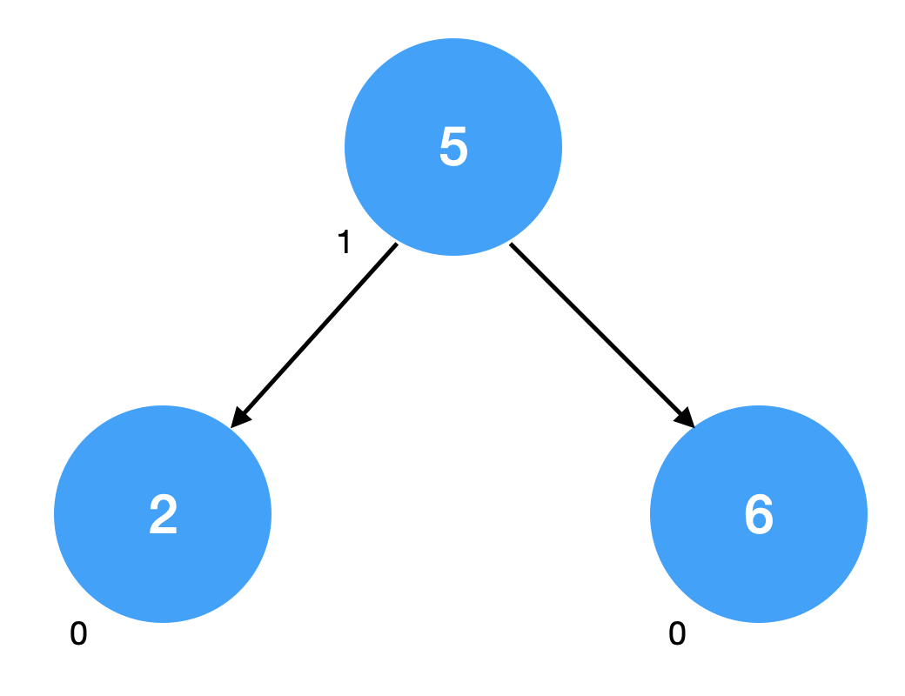
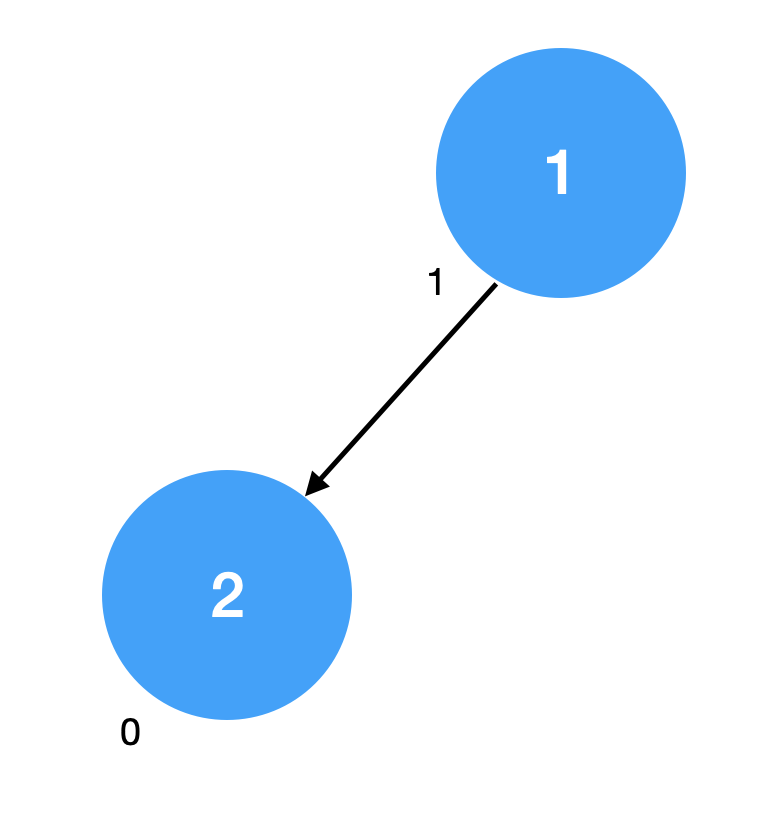
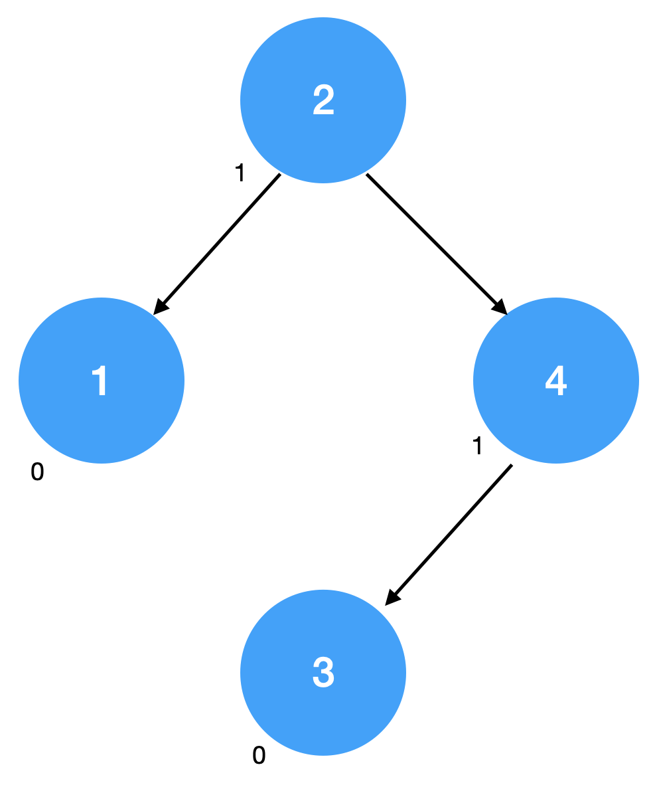
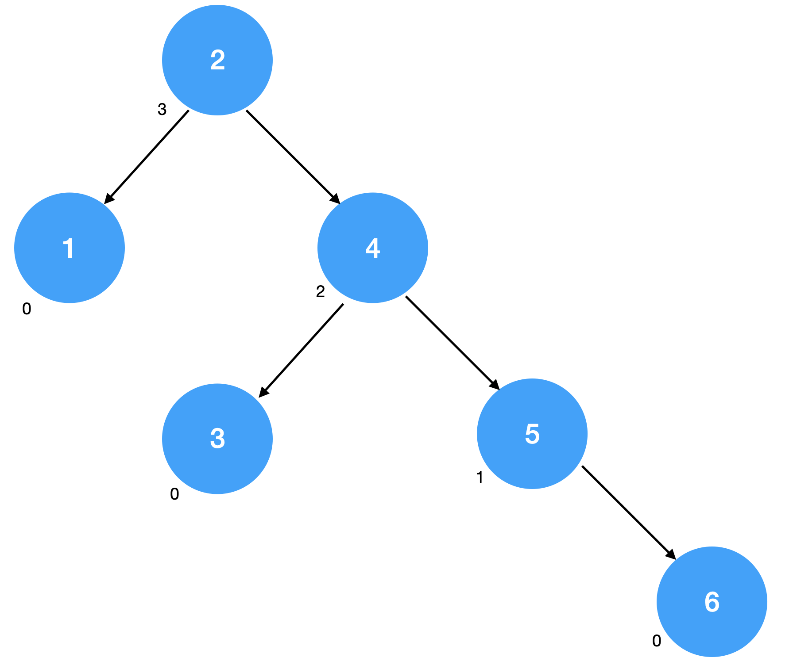

# Verify AVL

## Setting up

Clone your student repo, edit it locally, commit and push to GitLab, and submit to Gradescope, exactly as in P1. When working on this, you should use Java 11 by changing your [Project SDK](https://www.jetbrains.com/help/idea/project-settings-and-structure.html#project-sdk) and [Project Language Level](https://www.jetbrains.com/help/idea/project-settings-and-structure.html#language-level) in the Project Structure of IntelliJ.

You should only edit `VerifyAVL.java` and do not change the method signature. Though, feel free to add private methods as you see fit.

## The assignment

Write Java code for an $`\Theta(n)`$ worst-case algorithm that verifies that a tree is actually an AVL tree in `VerifyAVL.java`.

You may assume the nodes of the tree have the following definition given in `AVLNode.java`.

When examining a tree, you must verify:
- the BST Property
- the AVL Balance Condition
- the correctness of the height information.

If it fails *any* of these properties, return `false`. Otherwise, return `true`.

You can assume that the keys and heights will not exceed `Integer.MAX_VALUE`.

## Grading

We will be running an autograder to grade your submission. All the tests are visible, so your final grade on Gradescope will be what goes into the gradebook. The points will be weighted more heavily on our stress tests, so note that the majority of the points you can get require that your code works without question.

As a motivation for you to get this assignment 100% correct, your Verify AVL code will be used to guarantee a correct implementation for `AVLTree` in P2.

## Testing

We've given you a testing harness in `VerifyAVLTests.java`. It reads in `tests.json` and tests your VerifyAVL method on the given tree.

The `tests.json` file contains as many test cases as you wish to add, where each case is on a separate line with the
following format:
`{"answer": true, "tree": [5,1,[2,0,null,null], [6,0,null,null]]}`

Note that the array representation of an `verifyavl.AVLNode` is as follows:
`[int key, int height, [verifyavl.AVLNode left], [verifyavl.AVLNode right]]`
Note that this representation is recursive i.e. `verifyavl.AVLNode left` and `verifyavl.AVLNode right` is another `verifyavl.AVLNode`

e.g. `[int key, int height, [int key, int height, [verifyavl.AVLNode left], [verifyavl.AVLNode right]], [int key, int height, [verifyavl.AVLNode left], [verifyavl.AVLNode right]]]`

So the example above is of a tree with a root node with key 5, a left child node with a key 2, and a right child node with a key 6.

We have provided you with 4 basic test cases:

- A correct AVL tree: `[5,1,[2,0,null,null], [6,0,null,null]]`

  
- A tree that violates the BST property: `[1,1,[2,0,null,null],null]`

  
- A tree with incorrect height labels: `[2,1,[1,0,null,null],[4,1,[3,0,null,null],null]]`

  
- A tree that violates the AVL balance property: `[2,3,[1,0,null,null],[4,2,[3,0,null,null],[5,1,null,[6,0,null,null]]]]`

  
